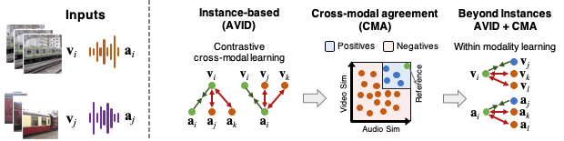

# AVID-CMA

This repo provides a PyTorch implementation and pretrained models for AVID-CMA, as described in our paper:

**[Audio-Visual Instance Discrimination with Cross-Modal Agreement](https://arxiv.org/pdf/2004.12943.pdf)**  
[Pedro Morgado](https://pedro-morgado.github.io/), [Nuno Vasconcelos](http://www.svcl.ucsd.edu/~nuno), [Ishan Misra](https://imisra.github.io/).  



AVID is a self-supervised learning approach to learn representations for video and audio, 
using a contrastive learning framework to perform cross-modal discrimination of video from audio and vice-versa. 
Contrastive learning defines positive and negative samples as individual instances. 
With cross-modal agreements (CMA), we generalize this definition. We group together multiple
instances as positives by measuring their similarity in both video and audio feature spaces. 
CMA creates better positive and negative sets, and allows us to calibrate visual similarities by
seeking within-modal discrimination of positive instances.

## Pre-trained models
We provide checkpoints for models pre-trained on Kinetics-400 and Audioset-2M, both for AVID and CMA methods.

| Method | Training DB | UCF Video@1 Acc. | HMDB Video@1 Acc. | Kinetics Video@1 Acc. | Model | Config |
|----------|----------|------|------|------|--------------------|--------------------|
| AVID     | Kinetics | 86.9 | 59.9 | 43.0 | [url](https://dl.fbaipublicfiles.com/avid-cma/checkpoints/AVID_Kinetics_Cross-N1024_checkpoint.pth.tar) | [config](configs/main/avid/kinetics/Cross-N1024.yaml) |
| AVID+CMA | Kinetics | 87.5 | 60.8 | 44.4 | [url](https://dl.fbaipublicfiles.com/avid-cma/checkpoints/AVID-CMA_Kinetics_InstX-N1024-PosW-N64-Top32_checkpoint.pth.tar) | [config](configs/main/avid-cma/kinetics/InstX-N1024-PosW-N64-Top32.yaml) |
| AVID     | Audioset | 91.0 | 64.1 | 46.5 | [url](https://dl.fbaipublicfiles.com/avid-cma/checkpoints/AVID_Audioset_Cross-N1024_checkpoint.pth.tar) | [config](configs/main/avid/audioset/Cross-N1024.yaml) |
| AVID+CMA | Audioset | 91.5 | 64.7 | 48.9 | [url](https://dl.fbaipublicfiles.com/avid-cma/checkpoints/AVID-CMA_Audioset_InstX-N1024-PosW-N64-Top32_checkpoint.pth.tar) | [config](configs/main/avid-cma/audioset/InstX-N1024-PosW-N64-Top32.yaml) |

You can download all the checkpoints at once using `./download_checkpoints.sh`.

## Requirements
Requirements for setting up your own conda environment can be found [here](./conda-spec-list.txt).
You can use this file to create your own conda environment as `conda create --name <env_name> --file conda-spec-list.txt`

## Datasets
This repo uses several public available datasets (Audioset, Kinetics-400, UCF and HMDB).
After downloading the datasets from the original sources, please update the data paths accordingly.
Data paths are set as global variables in the respective dataloader scripts: `datasets/audioset.py`, `datasets/kinetics.py`, `datasets/ucf.py` and `datasets/hmdb.py`.

## Self-supervised training with AVID and CMA
The main training script is `main-avid.py`, which takes as an argument the path to the training config file.
- Config files for AVID training can be found in [configs/main/avid](configs/main/avid).
- Config files for AVID+CMA training can be found in [configs/main/avid-cma](configs/main/avid-cma).

For example, to train with AVID on Kinetics, simply run:
```
python main-avid.py configs/main/avid/kinetics/Cross-N1024.yaml
```

*[Warning]* AVID-CMA training should be initialized from an AVID model.
To train an AVID-CMA model, it is important to train the AVID model first. 
While we provide checkpoints for an AVID model, the memory bank (used by CMA to find positive correspondences) is defined for the specific version of Kinetics/Audioset dataset we have.

By default, the script uses all visible gpus. Multi-node training is also possible. For example, to train on 4 nodes, run:
```
node0>> python main-avid.py configs/main/avid/kinetics/Cross-N1024.yaml --dist-url tcp://{NODE0-IP}:1234 --multiprocessing-distributed --world-size 4 --rank 0
node1>> python main-avid.py configs/main/avid/kinetics/Cross-N1024.yaml --dist-url tcp://{NODE0-IP}:1234 --multiprocessing-distributed --world-size 4 --rank 1
node2>> python main-avid.py configs/main/avid/kinetics/Cross-N1024.yaml --dist-url tcp://{NODE0-IP}:1234 --multiprocessing-distributed --world-size 4 --rank 2
node3>> python main-avid.py configs/main/avid/kinetics/Cross-N1024.yaml --dist-url tcp://{NODE0-IP}:1234 --multiprocessing-distributed --world-size 4 --rank 3
```
Refer to pytorch [documentation](https://pytorch.org/docs/stable/distributed.html#tcp-initialization) for additional information on how to set up the distributed initialization method (`--dist_url` argument). 

## Evaluation
We evaluate AVID and AVID-CMA models on UCF and HMDB by fine-tuning the whole model, and on Kinetics by training a linear classifier.
Full model finetuning is handled by `eval-action-recg.py`, and linear classification by `eval-action-recg-linear.py`.
These scripts take two config files: an evaluation config file that defines all evaluation hyper-parameters, and the training config file the specifies the original model.

For example, to evaluate on UCF Split-1 (full finetuning), simply run:
```
python eval-action-recg.py configs/benchmark/ucf/8at16-fold1.yaml configs/main/avid/kinetics/Cross-N1024.yaml
```
To evaluate on Kinetics (linear classification), run:
```
python eval-action-recg-linear.py configs/benchmark/kinetics/8x224x224-linear.yaml configs/main/avid/kinetics/Cross-N1024.yaml
```

## License
See the [LICENSE](LICENSE) file for details.

## Citation
If you find this repository useful in your research, please cite:
```
@inproceedings{morgado_avid_cma,
  title={Audio-visual instance discrimination with cross-modal agreement},
  author={Morgado, Pedro and Vasconcelos, Nuno and Misra, Ishan},
  journal={arXiv preprint arXiv:2004.12943},
  year={2020}
}
```
